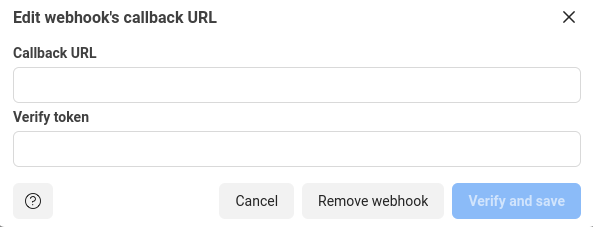

# Whatsapp bot using sarufi api and heyoo

This repo is to walk you through, setting up sarufi with whatsapp.

## The way to go

Log into your account, create a python repl.

Upload/copy `main.py` code into your replit repl created.  

In your repl, navigate to Tools --> packages, then install `heyoo`.

Navigate to Tools--> Secrets to create environment variables.

Navigate to *Getting started* to get whatsApp cloud `token` and `phone number ID`.

Create

  `phone_number_id`--> to store whatsapp cloud phone ID
  
  `whatsapp_token` --> Your whatsapp token
  
  `username` --> Your sarufi username
  
  `password`--> sarufi password
  
  `bot_id`--> Your sarufi bot id

After creating the secret keys, run your `main.py`. A small `webview window` will open up with a url that looks like `https://{your repl name}.{your replit usermae}.repl.co`.

Copy the url, the navigate to your whatsapp cloud account --> `configuration` --> edit --> then paste the url into callback url.

Go into your repl, copy the `VERIFY_TOKEN` --> paste into verify token in your whatsapp cloud --> **verify and save**